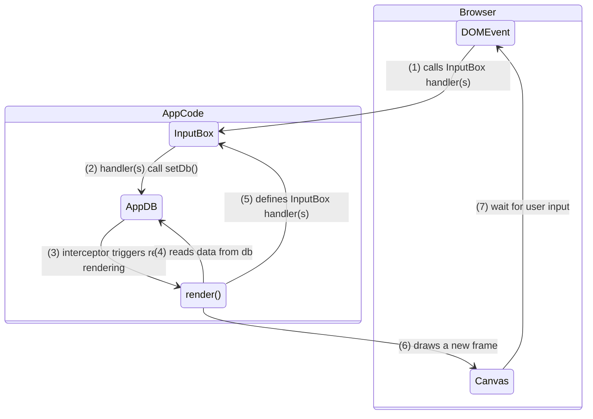

# Perspective toy

Live URL: https://luketurner.org/perspective-toy 

A little experiment in using perspective drawing techniques (horizon lines and vanishing points) to make "3D-looking" boxes. Users can manipulate the location of the horizon and vanishing points to change the perspective of the box. Currently supports 1P (one-point) and 2P (two-point) perspective types.

Inspired by the [1994 Perspective Drawing Series](https://marshallart.com/SHOP/all-products/all-videos/1994-perspective-drawing-series/) of lectures. I watched them recently and thought it would be fun to implement some of the principles using a JS program.

Of course, if you really want to render a cube, you should use a 3D rendering API. This is purely a for-fun experiment to build intuition around perspective drawing.

## Design notes

This is a zero-dependency application that renders entirely to a Canvas element -- even the UI is in-canvas.

Application state is stored in a module-global object called the "AppDB" (or `db` in the code). Any code can read data from the DB at any time. Code that writes to the DB must use the `setDb()` function, in order to track the change properly.

Additionally, it's possible to define interceptors that run code before and/or after the DB is updated. This is used, for example, to re-render the app when a DB update occurs.

This is roughly following the re-frame pattern.

One major difference is that, since the entire UI is within a single Canvas, we can't rely on DOM event handling to the same degree as for a DOM-based UI.

The canvas emits events, e.g. the `click` event, and some code needs to take the X, Y coordinates of the click and determine which, if any, interactive elements are "underneath" the cursor when the click happens. This logic is encapsulated in the "Input Boxes" concept -- Input Boxes are interactive zones within the canvas that are created when the app is rendered, and can have event handlers (e.g. `onClick`, `onDrag`) that are called when the user performs an interaction (click, drag) within the box.

So, the user does some interaction with the app (e.g. clicking). What happens?

1. A DOM Event handler is called check if any InputBoxes exist to handle the interaction. If so, the InputBox handler is called.
2. The InputBox handler (usually) updates application state by calling `setDb()`.
3. An AppDB interceptor automatically re-runs the renderer after each state change.
4. The renderer reads any data it needs from the AppDB.
5. The renderer defines InputBox handlers to accept further user input.
6. The renderer draws a new frame of the UI into the Canvas.

The flow is roughly illustrated below:



## Local Usage / Development

Built with vite. Commands:

```bash
npm install     # install deps (incl. vite)

npm run start   # run dev server

npm run build   # build prod
```

The live URL is served by Github Pages from this repository.